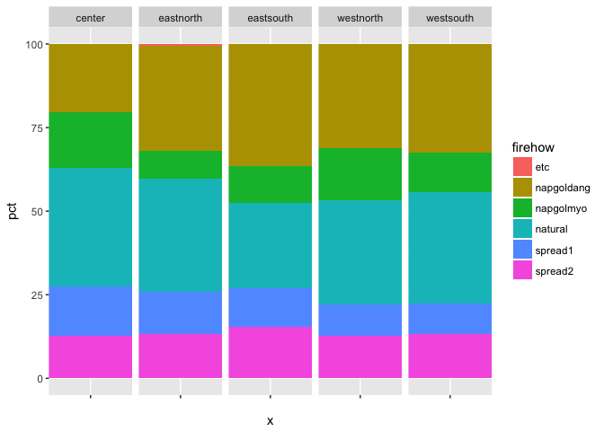
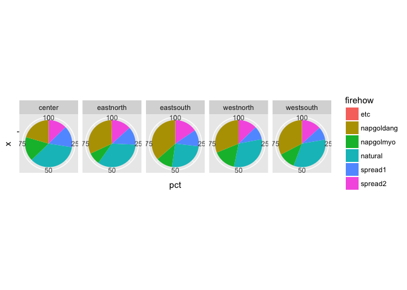

datascience\_report
================

서울시 지역에 따른 장례방식 선호차이
====================================

------------------------------------------------------------------------

### <서론>

------------------------------------------------------------------------

1. 요약
-------

서울시 내에서 지역에 따른 장례방식의 차이가 있었는데 그것이 흔히 잘사는 지역이 속해있는 권역 **동북**, **동남**, **중심** 권에서는 상대적으로 비용이 큰 장례방식을 선호한다고 볼 수 있었다.

2. 분석주제
-----------

지역에 따른 장례방식의 차이, 매장인지 화장인지 더불어 화장을 택한 가구주들의 화장 후 유골안치 방법에 대한 응답 비율을 보면 흔히 서울에서 집값이 높고 잘사는 지역 *광진구*, *성북구* 가 속한 **동북권**과 *서초구*, *강남구*, *송파구* 가 속한 **동남권** , *양천구*, *동작구* 가 속한 **서남권**에서는 '더 비싼 비용의 장례방식 *산이 필요하고 유지비가 큰 매장*, *가족 명의의 땅이 필요한 지정된 곳에 유골 뿌리기* 이나 *지속적인 비용이 필요한 납골당* 을 선호할 것이다'에서 고안하였다.

3. 데이터 선정
--------------

**변수 선정 이유**

개인적인 경험으로 작년에 할아버지가 돌아가셨는데 장례비용이 절차에 따라 다르다는 것을 알았다. 돈이 없는 사람은 장례를 제대로 치르지도 못하겠다고 생각해봤는데 응답지에 본인이 생각한 것과 상통하는 부분이 있어서 주제로 선정했다.

**데이터 출처 및 구성**

[서울복지실태조사](http://data.si.re.kr/sisurvey2015er17)

### <본론>

------------------------------------------------------------------------

4. 분석
-------

**라이브러리 불러오기**

분석에 사용하기 위해 필요한 함수들을 불러들인다.

``` r
library(readxl)
library(dplyr)
```

    ## 
    ## Attaching package: 'dplyr'

    ## The following objects are masked from 'package:stats':
    ## 
    ##     filter, lag

    ## The following objects are masked from 'package:base':
    ## 
    ##     intersect, setdiff, setequal, union

``` r
library(ggplot2)
```

**데이터 불러오기**

분석할 데이터가 들어있는 자료를 살펴봤을 때, 확장자가 xlsx로 구성된 엑셀 파일이며 sheet가 하나여서 sheet 번호는 설정하지 않았고 `col_names = F` 파라미터 또한 첫 번째 행부터 데이터가 사용되므로 사용하지않고 할당했다.

``` r
raw_data <- read_excel("seoul_data.xlsx")
raw <- raw_data
```

**데이터 정제하기**

`head()`, `str()`, `View()` 함수를 통해 seoul\_data를 파악. 데이터의 특성상 보고서가 너무 길어질 수 있기에 임시로 비활성화

``` r
#head(raw)
#View(raw)
#str(raw)
```

**변수 검토**

장례방식 `afterdeath`과 화장방법 `firehow`로 변수명을 변경해 준 뒤에 각 변수에 문자열변수나 이상치나 결측치가 없는 지 확인해 본 결과 99라는 이상치 *무응답* 이 한 명이여서 분석에 도움을 줄 것 같지 않아 그것을 제거해 주고 제거된 것을 확인하였다.

``` r
raw <- rename(raw, 
              afterdeath = F17,
              firehow = F17_1)
class(raw$afterdeath)
```

    ## [1] "numeric"

``` r
table(raw$afterdeath)
```

    ## 
    ##    1    2 
    ##  594 2425

``` r
class(raw$firehow)
```

    ## [1] "numeric"

``` r
table(raw$firehow)
```

    ## 
    ##   1   2   3   4   5   6  99 
    ## 758 291 772 271 330   2   1

``` r
raw$firehow <- ifelse(raw$firehow == 99, NA, raw$firehow)
table(raw$firehow)
```

    ## 
    ##   1   2   3   4   5   6 
    ## 758 291 772 271 330   2

**전처리1**

5권역 `area`에서1,2,3,4 라고 답변하였으므로 코드북과 같은이름으로 도심권 `center`, 동북권 `eastnorth`, 서북권 `westnorth`, 서남권 `westsouth`, 동남권 `eastsouth`으로 바꿔주었고 마찬가지로 화장 후 유골 안치방법 `firehow`에 대해서도 납골당 `napgoldang`, 납골묘 `napgolmyo`, 자연장지 `natural`, 정해진 산골장소 `spread1`, 강이나 산 `spread2`, 기타 `etc` 등으로 `mutate()` 와 `%in%` 을 사용하여 출력해 보았다.

``` r
raw <- raw %>% mutate(area = ifelse(area %in% c(1), "center",
                                    ifelse(area %in% c(2), "eastnorth",
                                           ifelse(area %in% c(3), "westnorth",
                                                  ifelse(area %in% c(4), "westsouth", "eastsouth")))))
raw <- raw %>% mutate(firehow = ifelse(firehow %in% c(1), "napgoldang",
                                       ifelse(firehow %in% c(2), "napgolmyo",
                                              ifelse(firehow %in% c(3), "natural",
                                                     ifelse(firehow %in% c(4), "spread1", 
                                                            ifelse(firehow %in% c(5), "spread2", "etc"))))))
table(raw$area)
```

    ## 
    ##    center eastnorth eastsouth westnorth westsouth 
    ##       380       770       625       482       762

``` r
table(raw$firehow)
```

    ## 
    ##        etc napgoldang  napgolmyo    natural    spread1    spread2 
    ##        597        758        291        772        271        330

**전처리2**

지역별 매장과 화장의 빈도를 보기위해 `favor`라고 추가하여 매장은 `burial`, 화장은 `cremation`이라고 변수를 처리한 뒤에 `group_by`로 묶어주어 differ1에 할당했고, 화장을 택한 사람들 중 지역에 따른 유골 안치 방법 6가지의 각 비율을 알아보기 위해 아래와 같은 방식으로 코드를 작성 후 differ2에 할당해 주었습니다.

``` r
differ1 <- raw %>% 
  mutate(favor = ifelse(afterdeath == 1, "burial", "cremation")) %>% 
  group_by(area, afterdeath)

dim(differ1)
```

    ## [1] 3019  829

``` r
differ2 <- raw %>% 
  filter(afterdeath == "2") %>% 
  filter(!is.na(firehow)) %>% 
  group_by(area, firehow) %>% 
  summarise(n = n()) %>% 
  mutate(tot_fire = sum(n)) %>% 
  mutate(pct = round(n/tot_fire * 100, 2))

dim(differ2)
```

    ## [1] 26  5

**그래프를 통한 분석**

아래의 그래프를 보면 화장 `cremation` 의 수가 지역에 관계없이 단연 압도적이지만 **동남권** 과 **동북권** , **서남권** 에서는 매장 `burial`이 차지하는 비중이 큼을 알 수 있다.

``` r
ggplot(data = differ1, aes(x = area, y = afterdeath, fill = favor)) + geom_col()
```


화장 후 유골안치 방법 6가지가 각 권역에서 차지하는 비율을 보고 싶었다. Piechart로 나타내기 위해 MASS패키지의 함수를 불러들인 뒤 막대그래프를 먼저 그렸다. 그 뒤에야 Piechart를 볼 수 있는 데 그것을 보면 먼저 **동북 **, **동남**, **서남**권에서 확연하게 납골당의 비율이 상대적으로 크다. 다음으로는 지정된 곳에 유골을 뿌리는 `spread1`을 보면 **중심권**에서 가장 큰 비율을 차지하는 데 예외적이라고 할 수 있다. 그러나 상대적으로 낙후된 지역이라 할 수있는 **서북권**에서 그 비율이 낮다.

``` r
library(MASS)
```

    ## 
    ## Attaching package: 'MASS'

    ## The following object is masked from 'package:dplyr':
    ## 
    ##     select

``` r
ggplot(data = differ2, aes(x = "", y = pct , fill = firehow)) +
  facet_grid(facets=. ~ area) + 
  geom_bar(stat="identity", width=1)
```



``` r
ggplot(differ2, aes(x ="", y = pct, fill = firehow)) +
  facet_grid(facet=.~ area ) +
  geom_bar(stat = "identity", width = 1) +
  coord_polar(theta = "y")
```



### <결론>

------------------------------------------------------------------------

5. 논의
-------

**한계점,비판점**

일단 집값이나 일반적인 인식과 상관없이 어떤 지역에도 고소득자나 차상위계층이 거주할 수 있다. 더 큰 한계점은 소득을 나타낼 수 있는 다른 변수와 합쳐서 제시했다면 훨씬 유의미한 결과가 나올 수 도 있다. 내가 쓴 보고서에서의 변수들만 가지고한다면 넘겨짚기나 끼워맞추기식 분석이라 비판받을 만 하다. 또 지역 `area`이라는 변수가 설문지에서부터 서울에서의 위치에 따라 5권역으로 묶여 있어서 아쉬운 바가 크다.

**추후 분석 방향**

구체적인 소득을 알 수 있는 지표나 재산을 나타내는 지표가 있다면 5권역으로 묶였어도 더 세밀한 분석이 가능할 것이다. 더불어 독립변수가 꼭 지역이나 소득관련된 것이아닌 가구주의 나이대를 고려한 변수가 된다면 자신이 원하는 장례절차를 통해 청장년층의 장례에 대한 인식 혹은 더 나아가 죽음을 맞이하는 인식의 차이를 엿볼 수 있을 것이다.
